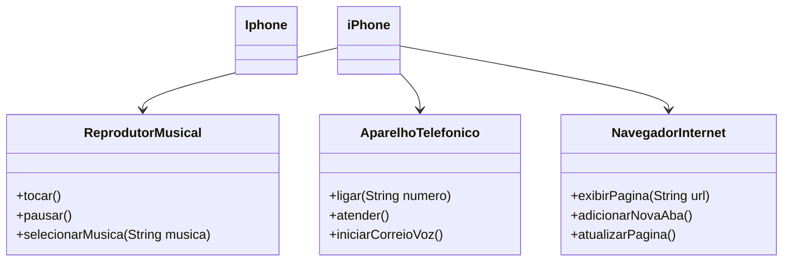

# Desafio: Modelagem e Diagramação de um Componente iPhone

## Contexto
O objetivo deste desafio foi modelar e diagramar um componente iPhone, abrangendo suas funcionalidades principais, 
que incluem um Reprodutor Musical, um Aparelho Telefônico e um Navegador na Internet. Com base no vídeo de lançamento do iPhone de 2007, 
foi solicitado a criação de um diagrama UML que representasse essas funcionalidades e a implementação das classes correspondentes em Java.

## Diagrama UML
O diagrama UML foi criado para ilustrar a estrutura das classes e suas interações. Aqui está a representação:

## Implementação
A implementação foi realizada em Java, utilizando uma estrutura orientada a objetos. Cada funcionalidade foi encapsulada em sua própria classe:

- ReprodutorMusical: Implementa métodos para tocar, pausar e selecionar músicas.
- AparelhoTelefonico: Implementa métodos para realizar chamadas, atender chamadas e iniciar o correio de voz.
- NavegadorInternet: Implementa métodos para exibir páginas, adicionar novas abas e atualizar páginas.

A classe `Iphone` foi projetada como a classe principal, onde as instâncias de cada funcionalidade são criadas e utilizadas. O método `main` na classe `Iphone` 
demonstra como as diferentes funcionalidades podem ser acessadas e utilizadas.

## Estrutura do Código
O código é dividido em várias classes:

- `ReprodutorMusical.java`
- `AparelhoTelefonico.java`
- `NavegadorInternet.java`
- `Iphone.java` (classe principal)
